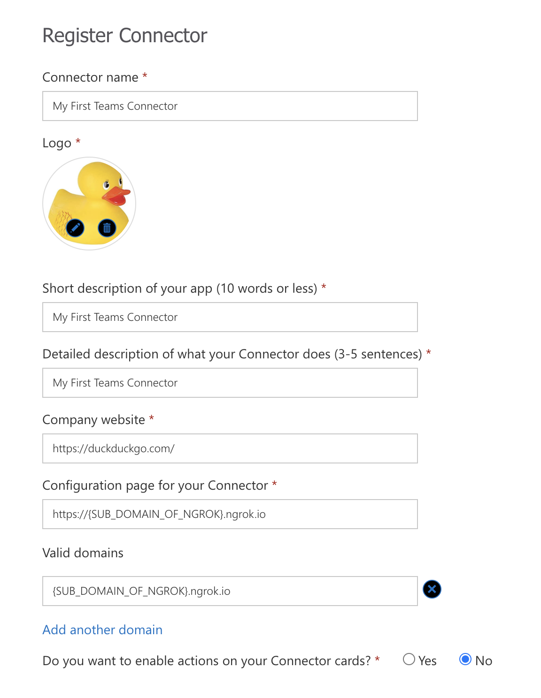

# Zeplin App for Microsoft Teams

Node version: v12.10.0

NPM version: v6.14.5

## Development

### Initial setup

- Clone the repository.
- Create [an envrionment at Microsoft Teams](https://docs.microsoft.com/en-us/microsoftteams/platform/concepts/build-and-test/prepare-your-o365-tenant). 
- Run `nvm use` to set node version.
- Install dependencies via `npm install`.
- Run `npm run ngrok` to tunnel localhost.
- Create an Office 365 Connector from [Connectors Developer Dashboard](https://aka.ms/ConnectorsDashboard).
  - While creating connector, the value for `Configuration page for your Connector` should be the url of `ngrok` tunnel and the value for `Valid domains` should be domain of `ngrok` tunnel, like in example.
   
- Run `cp .env.example .env` to create `.env` file.
- Set the environment variables in `.env` file. You can check the comments to set the variables.
- Run `npm run build:package` to create a zip file for Microsoft Teams.
- Upload the `dist/package.zip` file from [admin panel of Microsoft Teams](https://admin.teams.microsoft.com/policies/manage-apps).
- Run `npm run dev` to run the app locally.
- Now, you can create a connector at [Microsoft Teams](https://teams.microsoft.com).

### Updating the url change of http tunnel

-  Change the URL of the configuration page and valid domains at [Connectors Developer Dashboard](https://aka.ms/ConnectorsDashboard).
- Change environment variables at `.env` file.
- Run `npm run build:package` to create a zip file for Microsoft Teams.
- Find the app at [admin panel of Microsoft Teams](https://admin.teams.microsoft.com/policies/manage-apps) and update it by uploading `dist/package.zip`.
- Check the [apps page at Microsoft Teams](https://teams.microsoft.com/_#/apps) the version updated. If not updated, redo the fifth step.

## See also
- [Exercise - Create and add Office 365 Connectors to teams](https://docs.microsoft.com/en-us/learn/modules/msteams-webhooks-connectors/7-exercise-o365-connectors)
- [Developer platform of Microsoft Teams](https://docs.microsoft.com/en-us/microsoftteams/platform/overview)
